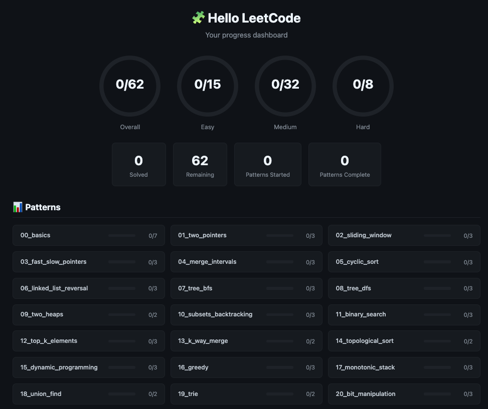

<div align="center">

# 🧩 Hello LeetCode

**54 LeetCode problems across 20 coding patterns — in Ruby.**

[](https://www.ruby-lang.org/)
[](./)
[](./)
[](LICENSE)



</div>

---

## Why This Exists

Most LeetCode repos dump 500+ problems with no structure. This one is different:

- **Pattern-first** — problems grouped by the 20 core algorithmic patterns
- **Zero setup** — each `.rb` file is self-contained with problem, stub, and tests
- **Learn by doing** — read the problem, implement the `# TODO`, run the file, see tests pass
- **Basics included** — forgot how a heap works? Check `00_basics/` before diving in
- **Progress tracking** — built-in CLI to track your progress and view a dashboard
- **Ruby-focused** — all solutions in idiomatic Ruby, no extra gems needed (just Ruby 3.0+ and SQLite)

## Quick Start

```bash
git clone https://github.com/AndrewNgKF/hello_leet.git
cd hello_leet

# Pick a problem and solve it:
ruby 01_two_pointers/two_sum_ii.rb

# Check your progress across all problems:
ruby progress.rb

# Check one pattern:
ruby progress.rb 01_two_pointers

# Check your solve history:
ruby progress.rb --log

# Open visual progress dashboard in browser:
ruby progress.rb --dashboard
```

### What's in each file

```
┌─────────────────────────────────────────┐
│ # Problem statement + examples          │  ← Read the problem
│ # Constraints & hints                   │
│                                         │
│ def solution(args)                      │  ← Write your solution
│   # TODO: implement                     │
│ end                                     │
│                                         │
│ class TestSolution < Minitest::Test     │  ← Tests run automatically
│   def test_example_1 ... end            │
│ end                                     │
└─────────────────────────────────────────┘
```

### Prerequisites

- **Ruby 3.0+** (that's it — no gems, no bundler, no setup)
- Check: `ruby --version`

---

## 📚 The 20 Patterns

These are the core algorithmic patterns. Master them, and you can break down virtually any coding interview problem.

| #   | Pattern                           | Folder                     | Key Idea                                                      | Starter Problems                                            |
| --- | --------------------------------- | -------------------------- | ------------------------------------------------------------- | ----------------------------------------------------------- |
| 1   | **Two Pointers**                  | `01_two_pointers/`         | Two indices moving toward each other or in the same direction | Two Sum II, 3Sum, Container With Most Water                 |
| 2   | **Sliding Window**                | `02_sliding_window/`       | Expand/shrink a window over a sequence                        | Max Subarray Sum, Longest Substring Without Repeating Chars |
| 3   | **Fast & Slow Pointers**          | `03_fast_slow_pointers/`   | Tortoise & hare — cycle detection, midpoint finding           | Linked List Cycle, Happy Number, Find Duplicate             |
| 4   | **Merge Intervals**               | `04_merge_intervals/`      | Sort by start, merge overlapping ranges                       | Merge Intervals, Insert Interval                            |
| 5   | **Cyclic Sort**                   | `05_cyclic_sort/`          | Numbers in range [0,n] → put each in its "correct" index      | Missing Number, Find All Duplicates                         |
| 6   | **In-place Linked List Reversal** | `06_linked_list_reversal/` | Reverse pointers in-place using prev/curr/next                | Reverse Linked List, Reverse Nodes in k-Group               |
| 7   | **Tree BFS**                      | `07_tree_bfs/`             | Level-by-level traversal using a queue                        | Level Order Traversal, Zigzag Traversal                     |
| 8   | **Tree DFS**                      | `08_tree_dfs/`             | Recursive/stack-based depth traversal                         | Max Depth, Path Sum, Diameter of Binary Tree                |
| 9   | **Two Heaps**                     | `09_two_heaps/`            | Min-heap + max-heap to track medians or partitions            | Find Median from Data Stream, Sliding Window Median         |
| 10  | **Subsets & Backtracking**        | `10_subsets_backtracking/` | Build combinations/permutations by exploring all branches     | Subsets, Permutations, Combination Sum                      |
| 11  | **Modified Binary Search**        | `11_binary_search/`        | Binary search on sorted/rotated/matrix data                   | Search Rotated Array, Find Peak Element                     |
| 12  | **Top K Elements**                | `12_top_k_elements/`       | Heaps or quickselect for k-th largest/smallest                | Top K Frequent Elements, Kth Largest Element                |
| 13  | **K-way Merge**                   | `13_k_way_merge/`          | Merge K sorted inputs using a min-heap                        | Merge K Sorted Lists, Smallest Range Covering K Lists       |
| 14  | **Topological Sort**              | `14_topological_sort/`     | Ordering nodes in a DAG by dependencies                       | Course Schedule, Alien Dictionary                           |
| 15  | **Dynamic Programming**           | `15_dynamic_programming/`  | Optimal substructure + overlapping subproblems                | Climbing Stairs, Coin Change, Longest Common Subsequence    |
| 16  | **Greedy**                        | `16_greedy/`               | Local optimal choice → global optimal                         | Jump Game, Task Scheduler, Gas Station                      |
| 17  | **Monotonic Stack**               | `17_monotonic_stack/`      | Stack maintaining increasing/decreasing order                 | Next Greater Element, Largest Rectangle in Histogram        |
| 18  | **Union Find**                    | `18_union_find/`           | Disjoint sets — connect components, detect cycles             | Number of Islands, Redundant Connection                     |
| 19  | **Trie**                          | `19_trie/`                 | Prefix tree for string lookups                                | Implement Trie, Word Search II                              |
| 20  | **Bit Manipulation**              | `20_bit_manipulation/`     | XOR, masks, shifts for clever math tricks                     | Single Number, Counting Bits, Power of Two                  |

---

## 🗺️ Recommended Study Order

Don't try all 20 at once. Follow this progression — each phase builds on the last:

```
 Phase 1                Phase 2                Phase 3
 ┌──────────────┐      ┌──────────────┐      ┌──────────────┐
 │ Two Pointers │─────▶│ Tree DFS     │─────▶│ Merge        │
 │ Sliding Win  │      │ Tree BFS     │      │  Intervals   │
 │ Binary Search│      │ Backtracking │      │ LL Reversal  │
 │              │      │              │      │ Fast & Slow  │
 │  9 problems  │      │  9 problems  │      │ Cyclic Sort  │
 └──────────────┘      └──────────────┘      │ 12 problems  │
                                             └──────┬───────┘
                                                    │
               Phase 5                Phase 4       │
              ┌──────────────┐      ┌──────────────┐│
              │ Topo Sort    │◀─────│ Top K        │◀
              │ Union Find   │      │ Two Heaps    │
              │ Greedy       │      │ K-way Merge  │
              │ DP           │      │ Mono Stack   │
              │ Bit Manip    │      │ Trie         │
              │  13 problems │      │ 11 problems  │
              └──────────────┘      └──────────────┘
```

<details>
<summary><strong>Phase 1: Foundations</strong> — Start here (9 problems)</summary>

1. **Two Pointers** — simplest pattern, builds intuition for pointer movement
2. **Sliding Window** — natural extension of two pointers
3. **Modified Binary Search** — fundamental technique you'll use everywhere
</details>

<details>
<summary><strong>Phase 2: Core Techniques</strong> (9 problems)</summary>

4. **Tree DFS** — recursive thinking, essential for interviews
5. **Tree BFS** — complements DFS, level-order problems
6. **Subsets & Backtracking** — systematic exploration of solution spaces
</details>

<details>
<summary><strong>Phase 3: Intermediate</strong> (12 problems)</summary>

7. **Merge Intervals** — common real-world pattern
8. **Linked List Reversal** — pointer manipulation practice
9. **Fast & Slow Pointers** — elegant cycle/midpoint detection
10. **Cyclic Sort** — niche but very efficient when applicable
</details>

<details>
<summary><strong>Phase 4: Advanced Data Structures</strong> (11 problems)</summary>

11. **Top K Elements** — heap fundamentals
12. **Two Heaps** — dual-heap technique
13. **K-way Merge** — multi-source merging
14. **Monotonic Stack** — stack-based problem solving
15. **Trie** — string-specific data structure
</details>

<details>
<summary><strong>Phase 5: Graph & Optimization</strong> (13 problems)</summary>

16. **Topological Sort** — DAG ordering
17. **Union Find** — disjoint sets
18. **Greedy** — proof-heavy but powerful
19. **Dynamic Programming** — the big one, save it for when you're comfortable
20. **Bit Manipulation** — clever tricks, usually optional
</details>

---

## 📁 Project Structure

```
hello_leet/
├── 00_basics/              # Data structure fundamentals (learn/reference)
│   ├── arrays_and_hashes.rb
│   ├── linked_list.rb
│   ├── binary_tree.rb
│   ├── stacks_and_queues.rb
│   ├── heap.rb
│   ├── graph.rb
│   └── doubly_linked_list.rb
├── 01_two_pointers/        # Pattern folders (01–20)
│   ├── README.md           #   Pattern explanation + approach
│   ├── two_sum_ii.rb       #   Problem files with tests
│   ├── three_sum.rb
│   └── container_with_most_water.rb
├── 02_sliding_window/
│   └── ...
├── ...                     # (20 pattern folders total)
├── progress.rb             # CLI entry point (~35 lines)
├── lib/                    # Modules: colors, db, runner, dashboard, log, stats
├── screenshots/            # Dashboard preview image
├── progress.db             # Auto-generated solve history (SQLite)
├── dashboard.html          # Auto-generated visual dashboard
├── LICENSE
└── README.md
```

The `00_basics/` folder has **working implementations** of core data structures (linked lists, trees, heaps, graphs) with explanations. Read these first if you need a refresher.

---

## 💡 Tips

| Tip                                       | Why                                          |
| ----------------------------------------- | -------------------------------------------- |
| Spend 20–30 min before looking at hints   | Struggle builds understanding                |
| Solve Easy problems first in each pattern | Build confidence, then level up              |
| Write brute force first, then optimize    | Interviewers value this approach             |
| Re-solve problems after a few days        | Spaced repetition cements patterns           |
| Time yourself                             | Easy: 15 min · Medium: 25 min · Hard: 45 min |
| Read the pattern README first             | Understand _why_ before _how_                |

---

## 🍴 Fork & Use

This project is meant to be forked! Here's how:

1. **Fork** this repo
2. **Clone** your fork: `git clone https://github.com/AndrewNgKF/hello_leet.git`
3. **Solve** problems — edit the `# TODO: implement` stubs
4. **Run** tests: `ruby 01_two_pointers/two_sum_ii.rb`
5. **Track** progress: `ruby progress.rb` (auto-logs solve timestamps)
6. **View history**: `ruby progress.rb --log` to see when you solved each problem
7. **Dashboard**: `ruby progress.rb --dashboard` to open a visual HTML dashboard
8. **Commit** your solutions to your fork

---

## License

[MIT](LICENSE) — use it however you want.
